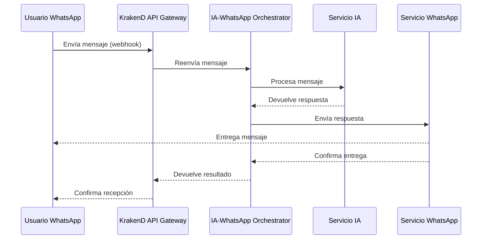
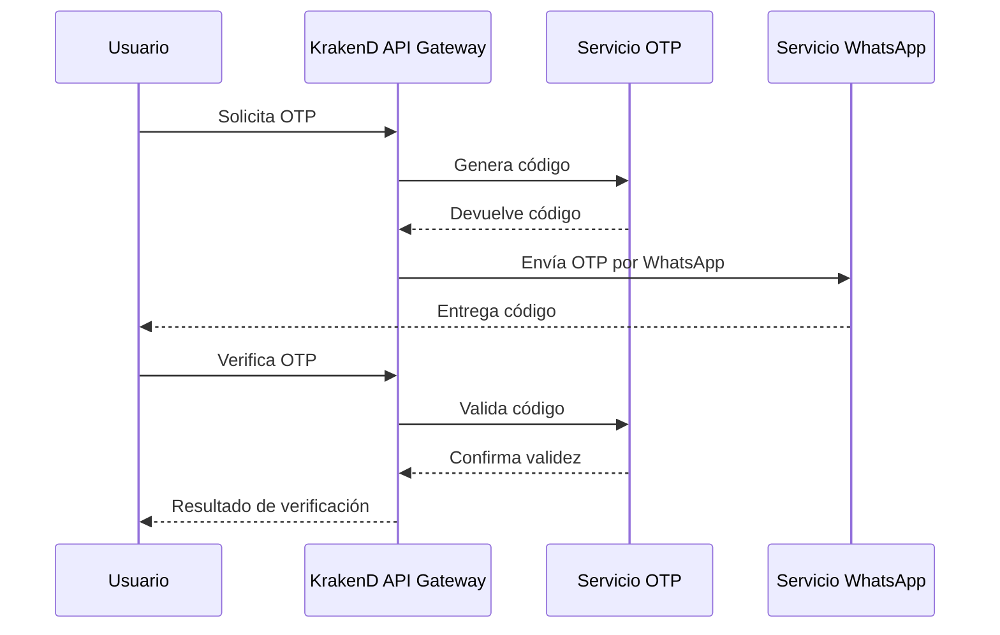

# Manual de Uso para Desarrolladores: KrakenD API Gateway con Integración de IA y WhatsApp

## Descripción General

Este manual está diseñado para ayudar a los desarrolladores a interactuar con nuestra API Gateway implementada en KrakenD, que integra servicios de IA conversacional y mensajería de WhatsApp. El gateway actúa como un punto único de entrada que orquesta la comunicación entre múltiples microservicios, proporcionando una forma estandarizada y segura de intercambiar datos.


## Información Técnica

- **Ambiente de Desarrollo**: http://localhost:7081 (puerto expuesto por Docker Compose)
- **Puerto Interno de KrakenD**: 8080 (dentro del contenedor)
- **Puerto de Métricas**: 7091 (mapeado desde el puerto 8090 interno)
- **Ambiente de Producción**: https://api.dominio.com (consultar con el equipo de infraestructura para acceso)
- **Formato**: Todas las solicitudes y respuestas utilizan JSON (`Content-Type: application/json`)
- **Versionamiento API**: v1 implícito en las rutas actuales

## Autenticación y Seguridad

**Nota**: La configuración actual no implementa autenticación. Se recomienda:

- Para desarrollo: Sin autenticación
- Para producción: Implementar JWT (modificar la configuración en `krakend.json` habilitando el middleware JWT)

Para la futura implementación de JWT, utiliza:
```bash
# Generar un token JWT para pruebas
./scripts/generate-jwt.sh
```

## Endpoints Disponibles

### 1. Verificación de Estado del Sistema

#### Endpoint de Salud
- **URL**: `/health`
- **Método**: `GET`
- **Descripción**: Verifica el estado operativo del sistema y servicios dependientes.
- **Ejemplo de Solicitud**:

```bash
curl -X GET http://localhost:7081/health
```

- **Respuesta Exitosa (200 OK)**:
```json
{
  "status": "ok",
  "version": "1.0.0",
  "timestamp": 1744236985,
  "services": {
    "ia_service": "up",
    "whatsapp_service": "up",
    "orchestrator": "up"
  }
}
```

#### Endpoint de Métricas
- **URL**: `/metrics`
- **Método**: `GET`
- **Descripción**: Proporciona métricas operativas del sistema en formato Prometheus.
- **Ejemplo de Solicitud**:

```bash
curl -X GET http://localhost:7081/metrics
```

- **Respuesta Exitosa**: Formato Prometheus (text/plain)

### 2. Servicio de IA (Comunicación Directa)

#### Conversación con IA
- **URL**: `/api/ia/conversation`
- **Método**: `POST`
- **Descripción**: Envía un mensaje al servicio de IA y obtiene una respuesta procesada.
- **Rate Limit**: 10 solicitudes por cliente por minuto
- **Parámetros de Solicitud**:

| Parámetro | Tipo | Requerido | Descripción |
|-----------|------|-----------|-------------|
| text | string | Sí | Texto de la consulta o mensaje |
| session_id | string | Sí | Identificador único de la sesión de conversación |
| language | string | No | Código ISO de idioma (por defecto: "es") |
| data | object | No | Datos adicionales para controlar el comportamiento de la IA |
| agent_id | integer | No | ID del agente o modelo de IA a utilizar |

- **Ejemplo de Solicitud**:

```bash
curl -X POST http://localhost:7081/api/ia/conversation \
  -H "Content-Type: application/json" \
  -d '{
    "text": "¿Cuáles son los horarios de atención?",
    "session_id": "user-123-session-456",
    "language": "es",
    "data": {"forceMode": "customer_service"},
    "agent_id": 1
  }'
```

- **Respuesta Exitosa (200 OK)**:
```json
{
  "metadata": {
    "intent": "consulta_horarios",
    "source": "ai_assistant",
    "confidence": 0.95
  },
  "session_id": "user-123-session-456",
  "text": "Nuestros horarios de atención son de lunes a viernes de 9:00 a 18:00 y sábados de 9:00 a 13:00. ¿Hay algo más en lo que pueda ayudarte?"
}
```

- **Posibles Errores**:
  - `400 Bad Request`: Faltan campos requeridos o formato inválido
  - `429 Too Many Requests`: Excedido el límite de solicitudes
  - `500 Internal Server Error`: Error en el servicio de IA
  
- **Notas de Implementación**:
  - El parámetro `data.forceMode` puede ser: "customer_service", "sales", "technical_support"
  - Para conversaciones continuas, mantener el mismo `session_id`

### 3. Servicio de WhatsApp (Comunicación Directa)

#### Envío de Mensajes
- **URL**: `/api/whatsapp/send-message`
- **Método**: `POST`
- **Descripción**: Envía un mensaje directo a un número a través de WhatsApp.
- **Rate Limit**: 5 solicitudes por cliente por minuto
- **Parámetros de Solicitud**:

| Parámetro | Tipo | Requerido | Descripción |
|-----------|------|-----------|-------------|
| phone_number | string | Sí | Número de teléfono del destinatario (formato internacional) |
| user_id | integer | Sí | ID del usuario o remitente en el sistema |
| message | string | Sí | Texto del mensaje a enviar |
| channel | string | No | Canal de comunicación (por defecto: "whatsapp") |
| purpose | string | No | Propósito del mensaje (notification, marketing, otp, etc.) |

- **Ejemplo de Solicitud**:

```bash
curl -X POST http://localhost:7081/api/whatsapp/send-message \
  -H "Content-Type: application/json" \
  -d '{
    "phone_number": "+593983606090",
    "user_id": 1,
    "message": "Gracias por tu compra. Tu pedido #12345 ha sido confirmado.",
    "channel": "whatsapp",
    "purpose": "notification"
  }'
```

- **Respuesta Exitosa (200 OK)**:
```json
{
  "message": "Gracias por tu compra. Tu pedido #12345 ha sido confirmado.",
  "message_id": "msg-20250410-123456",
  "sent_at": "2025-04-10T15:30:45.123-05:00",
  "success": true,
  "timestamp": 1744296645
}
```

- **Posibles Errores**:
  - `400 Bad Request`: Faltan campos requeridos o formato inválido
  - `429 Too Many Requests`: Excedido el límite de solicitudes
  - `500 Internal Server Error`: Error en el servicio de WhatsApp

- **Notas de Implementación**:
  - El formato del número puede ser con o sin el prefijo "@s.whatsapp.net"
  - Se recomienda incluir siempre el código de país en el número de teléfono

#### Webhook para Notificaciones de WhatsApp
- **URL**: `/api/whatsapp/webhook`
- **Método**: `POST`
- **Descripción**: Recibe y procesa mensajes y eventos entrantes desde WhatsApp.
- **Parámetros de Solicitud**:

| Parámetro | Tipo | Requerido | Descripción |
|-----------|------|-----------|-------------|
| messageId | string | Sí | ID único del mensaje |
| sender | string | Sí | Número del remitente (formato: "593983606090@s.whatsapp.net") |
| pushName | string | No | Nombre del remitente según su perfil |
| timestamp | integer | No | Marca de tiempo Unix en segundos |
| type | string | No | Tipo de mensaje (text, image, audio, etc.) |
| content | string | Sí | Contenido o texto del mensaje |
| mediaUrl | string | No | URL del contenido multimedia (si aplica) |
| data | object | No | Datos adicionales del mensaje |

- **Ejemplo de Solicitud (Mensaje de Texto)**:

```bash
curl -X POST http://localhost:7081/api/whatsapp/webhook \
  -H "Content-Type: application/json" \
  -d '{
    "messageId": "msg-waid-001",
    "sender": "593983606090@s.whatsapp.net",
    "pushName": "Juan Pérez",
    "timestamp": 1744296645,
    "type": "text",
    "content": "Hola, necesito información sobre mi pedido #12345",
    "mediaUrl": ""
  }'
```

- **Respuesta Exitosa (200 OK)**:
```json
{
  "status": "recibido",
  "ia_response": {
    "metadata": {
      "intent": "consulta_pedido",
      "source": "ai_assistant"
    },
    "session_id": "593983606090@s.whatsapp.net",
    "text": "Para proporcionarte información sobre tu pedido #12345, necesito verificar algunos datos. ¿Podrías confirmar tu nombre completo?"
  },
  "whatsapp_response": {
    "message": "Para proporcionarte información sobre tu pedido #12345, necesito verificar algunos datos. ¿Podrías confirmar tu nombre completo?",
    "message_id": "msg-20250410-654321",
    "sent_at": "2025-04-10T15:31:00.456-05:00",
    "success": true,
    "timestamp": 1744296660
  }
}
```

- **Ejemplo de Solicitud (Solicitud de OTP)**:

```bash
curl -X POST http://localhost:8080/api/whatsapp/webhook \
  -H "Content-Type: application/json" \
  -d '{
    "messageId": "msg-waid-002",
    "sender": "593983606090@s.whatsapp.net",
    "pushName": "Juan Pérez",
    "timestamp": 1744296700,
    "type": "text",
    "content": "Enviar OTP",
    "data": {
      "type": "otp"
    }
  }'
```

- **Respuesta Exitosa para OTP (200 OK)**:
```json
{
  "status": "recibido",
  "ia_response": {
    "metadata": {
      "intent": "otp_request",
      "source": "ai_assistant"
    },
    "session_id": "593983606090@s.whatsapp.net",
    "text": "Enviando tu código de verificación..."
  },
  "whatsapp_response": {
    "otp": "ec8d356e-fe98-45ed-b270-8332a5a926c8",
    "timestamp": 1744296705,
    "signature": "firma-simulada-ec8d356e",
    "success": true,
    "message": "Tu código de verificación es: 4567. Este código expirará en 10 minutos."
  }
}
```

- **Posibles Errores**:
  - `400 Bad Request`: Faltan campos requeridos o formato inválido
  - `500 Internal Server Error`: Error en el procesamiento del webhook

- **Notas de Implementación**:
  - El sistema detecta automáticamente la intención (intent) del mensaje y responde adecuadamente
  - Para solicitudes de OTP, incluir `data.type: "otp"` en la solicitud

### 4. Servicio de OTP (One-Time Password)

#### Generación de OTP
- **URL**: `/api/whatsapp/send-otp`
- **Método**: `POST`
- **Descripción**: Genera y envía un código OTP al número especificado.
- **Parámetros de Solicitud**:

| Parámetro | Tipo | Requerido | Descripción |
|-----------|------|-----------|-------------|
| phone_number | string | Sí | Número de teléfono del destinatario (formato internacional) |
| purpose | string | No | Propósito del OTP (login, verification, password_reset, etc.) |

- **Ejemplo de Solicitud**:

```bash
curl -X POST http://localhost:7081/api/whatsapp/send-otp \
  -H "Content-Type: application/json" \
  -d '{
    "phone_number": "+593983606090",
    "purpose": "login"
  }'
```

- **Respuesta Exitosa (200 OK)**:
```json
{
  "otp": "ec8d356e-fe98-45ed-b270-8332a5a926c8",
  "timestamp": 1744296800,
  "signature": "firma-simulada-ec8d356e",
  "expires_at": "2025-04-10T15:50:00.000-05:00"
}
```

#### Verificación de OTP
- **URL**: `/api/whatsapp/verify-otp`
- **Método**: `POST`
- **Descripción**: Verifica un código OTP previamente enviado.
- **Parámetros de Solicitud**:

| Parámetro | Tipo | Requerido | Descripción |
|-----------|------|-----------|-------------|
| phone_number | string | Sí | Número de teléfono del usuario (formato internacional) |
| otp | string | Sí | Código OTP a verificar |

- **Ejemplo de Solicitud**:

```bash
curl -X POST http://localhost:7081/api/whatsapp/verify-otp \
  -H "Content-Type: application/json" \
  -d '{
    "phone_number": "+593983606090",
    "otp": "4567"
  }'
```

- **Respuesta Exitosa (200 OK)**:
```json
{
  "verified": true,
  "timestamp": 1744296850,
  "message": "OTP verificado correctamente"
}
```

- **Respuesta de Error (400 Bad Request)**:
```json
{
  "verified": false,
  "timestamp": 1744296850,
  "message": "OTP inválido o expirado",
  "error_code": "INVALID_OTP"
}
```

### 5. Orquestación Combinada (IA + WhatsApp)

#### Procesamiento y Respuesta Integrados
- **URL**: `/api/process-and-respond`
- **Método**: `POST`
- **Descripción**: Procesa un mensaje con IA y envía la respuesta a través de WhatsApp en un flujo integrado.
- **Rate Limit**: 3 solicitudes por cliente por minuto
- **Parámetros de Solicitud**:

| Parámetro | Tipo | Requerido | Descripción |
|-----------|------|-----------|-------------|
| text | string | Sí | Texto de la consulta o mensaje |
| session_id | string | No | Identificador de sesión (se generará uno si no se proporciona) |
| language | string | No | Código ISO de idioma (por defecto: "es") |
| data | object | No | Datos adicionales para el procesamiento |
| agent_id | integer | No | ID del agente o modelo de IA a utilizar |
| phone_number | string | Sí | Número de teléfono del destinatario |
| user_id | integer | No | ID del usuario en el sistema |
| purpose | string | No | Propósito del mensaje |
| channel | string | No | Canal de comunicación (por defecto: "whatsapp") |

- **Ejemplo de Solicitud**:

```bash
curl -X POST http://localhost:7081/api/process-and-respond \
  -H "Content-Type: application/json" \
  -d '{
    "text": "Estamos procesando tu solicitud #54321. Gracias por tu paciencia.",
    "session_id": "user-system-notification-123",
    "language": "es",
    "data": {"forceMode": "notification"},
    "agent_id": 1,
    "phone_number": "+593983606090",
    "user_id": 1,
    "purpose": "notification",
    "channel": "whatsapp"
  }'
```

- **Respuesta Exitosa (200 OK)**:
```json
{
  "ia_response": {
    "metadata": {
      "intent": "notificacion_sistema",
      "source": "ai_assistant"
    },
    "session_id": "user-system-notification-123",
    "text": "Estamos procesando tu solicitud #54321. Gracias por tu paciencia."
  },
  "whatsapp_response": {
    "message": "Estamos procesando tu solicitud #54321. Gracias por tu paciencia.",
    "message_id": "msg-20250410-987654",
    "sent_at": "2025-04-10T15:40:00.789-05:00",
    "success": true,
    "timestamp": 1744297200
  }
}
```

- **Posibles Errores**:
  - `400 Bad Request`: Faltan campos requeridos o formato inválido
  - `429 Too Many Requests`: Excedido el límite de solicitudes
  - `500 Internal Server Error`: Error en alguno de los servicios

#### Procesamiento de Mensajes de Bot
- **URL**: `/api/bot/process-message`
- **Método**: `POST`
- **Descripción**: Procesa mensajes de bot con transformación automática entre formatos de IA y WhatsApp.
- **Parámetros de Solicitud**:

| Parámetro | Tipo | Requerido | Descripción |
|-----------|------|-----------|-------------|
| messageId | string | Sí | ID único del mensaje |
| sender | string | Sí | Identificador del remitente |
| content | string | Sí | Contenido del mensaje |
| type | string | No | Tipo de mensaje (por defecto: "text") |

- **Ejemplo de Solicitud**:

```bash
curl -X POST http://localhost:7081/api/bot/process-message \
  -H "Content-Type: application/json" \
  -d '{
    "messageId": "bot-msg-001",
    "sender": "bot-system-123",
    "content": "¿Cómo puedo ayudarte hoy?",
    "type": "text"
  }'
```

- **Respuesta Exitosa (200 OK)**:
```json
{
  "ia_processed": true,
  "whatsapp_delivered": true,
  "message_id": "msg-20250410-135790",
  "timestamp": 1744297300
}
```

## Formatos y Convenciones

### Formato de Números de Teléfono
- **Formato Internacional**: Comenzar con "+" seguido del código de país (ej. `+593983606090`)
- **Formato WhatsApp**: Número sin "+" seguido de "@s.whatsapp.net" (ej. `593983606090@s.whatsapp.net`)
- **Normalización**: El sistema normaliza automáticamente entre ambos formatos

### Códigos de Error
| Código HTTP | Descripción | Posibles Causas |
|-------------|-------------|-----------------|
| 400 | Bad Request | Faltan parámetros requeridos o formato incorrecto |
| 404 | Not Found | Endpoint no existe o recurso no encontrado |
| 429 | Too Many Requests | Excedido el límite de solicitudes (rate limit) |
| 500 | Internal Server Error | Error en los servicios backend |
| 502 | Bad Gateway | Error de comunicación entre servicios |
| 504 | Gateway Timeout | Tiempo de espera agotado en respuesta del servicio |

### Estructura de Respuestas de Error
```json
{
  "error": true,
  "message": "Descripción del error",
  "error_code": "ERROR_CODE",
  "timestamp": 1744297400,
  "details": {
    // Información adicional específica del error
  }
}
```

## Flujos Comunes

### 1. Flujo de Recepción y Respuesta de Mensaje



### 2. Flujo de Generación y Verificación de OTP



## Pruebas y Depuración

### Configuración de Docker Compose

La configuración de Docker Compose para este proyecto utiliza:

```yaml
version: '3'
services:
  krakend:
    image: devopsfaith/krakend:latest
    volumes:
      - ./config:/etc/krakend
    environment:
      FC_ENABLE: 1
      FC_PARTIALS: "/etc/krakend/partials"
      FC_SETTINGS: "/etc/krakend/settings"
    ports:
      - "7081:8080"  # API Gateway accesible en localhost:7081
      - "7091:8090"  # Métricas accesibles en localhost:7091
    command: run -c /etc/krakend/krakend.json
    restart: on-failure
    networks:
      - ia-whatsapp-network

networks:
  ia-whatsapp-network:
    external: true
```

### Comandos de Docker Útiles

```bash
# Ver logs del orquestador
sudo docker compose logs ia-whatsapp-orchestrator

# Ver logs de KrakenD
sudo docker compose logs krakend

# Reiniciar servicios después de cambios
sudo docker compose down
sudo docker compose up -d --build

# Verificar el estado de los contenedores
sudo docker compose ps

# Acceder a la shell del contenedor de KrakenD
sudo docker compose exec krakend sh
```

### Verificación de Estado con scripts

```bash
# Verificar que KrakenD esté ejecutándose
./scripts/send-otp.sh

# Validar configuración de KrakenD
./scripts/check-config.sh
```

## Consideraciones de Seguridad y Limitaciones

1. **Limitaciones de Tasa (Rate Limiting)**:
   - Implementado a nivel de IP para prevenir abusos
   - Específico para cada endpoint según su criticidad

2. **Validación de Esquemas**:
   - Todos los endpoints validan el formato JSON según esquemas definidos
   - Se recomienda verificar la estructura de solicitud antes de enviar

3. **Consideraciones para Producción**:
   - Implementar JWT para autenticación
   - Habilitar HTTPS/TLS
   - Configurar logs adecuados
   - Revisar políticas de CORS

## Soporte y Contacto

Para consultas técnicas:
- **Responsable**: Equipo de Desarrolladores Backend
- **Correo**: devteam@example.com
- **Repositorio**: git@github.com:example/krakend-ia-whatsapp-integration.git

---

Generado: 10 de Abril de 2025
Versión del Documento: 1.0.0